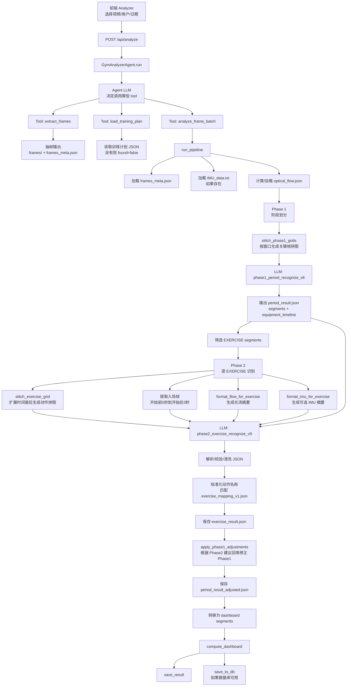

# 当前动作识别 Flow

本文只描述当前代码里的实际流程，不包含 Dify、Agent Verifier、ReAct 或后续改造设想。

核心入口：

- `gym_analyzer/api.py`
- `gym_analyzer/agent.py`
- `gym_analyzer/tools.py`
- `gym_analyzer/pipeline.py`
- `gym_analyzer/recognizer.py`
- `gym_analyzer/stitcher.py`
- `gym_analyzer/prompts/phase1_period_recognize_v6.yaml`
- `gym_analyzer/prompts/phase2_exercise_recognize_v9.yaml`

## 总体流程



## 1. 前端触发

前端页面：

```text
gym_analyzer/analyzer.html
```

用户在页面中选择：

- 视频文件
- 用户
- 日期
- 体重
- 性别
- 年龄

然后调用：

```text
POST /api/analyze
```

对应后端：

```text
gym_analyzer/api.py
```

后端不会同步完成分析，而是把任务放到后台：

```text
background_tasks.add_task(_run_analysis, ...)
```

前端通过：

```text
GET /api/analyze/progress
```

轮询进度。

## 2. Agent 调度层

当前系统不是直接调用 pipeline，而是先进入：

```text
GymAnalyzerAgent
```

位置：

```text
gym_analyzer/agent.py
```

Agent 会调用 LLM：

```text
POST {GATEWAY_URL}/chat/completions
```

并通过 tool calling 决定调用哪些工具。

当前主要工具定义在：

```text
gym_analyzer/tools.py
```

核心工具包括：

- `extract_frames`
- `load_training_plan`
- `analyze_frame_batch`
- `compute_dashboard`
- `save_to_db`
- `save_result`

也就是说，当前系统已经有一层 Agent，但这个 Agent 主要负责“流程编排”，不是我们讨论的那种“易混动作专项 verifier agent”。

## 3. 抽帧阶段

工具：

```text
extract_frames(video_path)
```

实际调用：

```text
gym_analyzer/extractor.py
```

输出目录：

```text
gym_analyzer/input/{video_stem}/frames/
gym_analyzer/input/{video_stem}/frames_meta.json
```

抽帧策略：

- 默认 1 fps
- 每帧缩放到 400 x 225
- 保存为 `frame_00000.jpg` 这种格式
- 生成 `frames_meta.json`

`frames_meta.json` 中每帧包含：

```json
{
  "index": 0,
  "timestamp": 0.0,
  "path": "frames/frame_00000.jpg"
}
```

## 4. 训练计划读取

工具：

```text
load_training_plan(video_path)
```

逻辑：

- 在视频同目录查找 `*training_plan*.json`
- 或查找 `*plan*.json`
- 找不到则返回 `found=false`

这一步不是动作识别的强依赖。

## 5. analyze_frame_batch

工具：

```text
analyze_frame_batch(frames_dir, video_duration_sec, training_plan, video_key)
```

它会进入真正的两阶段识别 pipeline：

```text
gym_analyzer/pipeline.py -> run_pipeline()
```

## 6. run_pipeline 主流程

`run_pipeline()` 做这些事：

1. 加载 `frames_meta.json`
2. 加载 `IMU_data.txt`，如果存在
3. 加载或计算 `optical_flow.json`
4. 执行 Phase 1
5. 执行 Phase 2
6. 汇总保存结果

## 7. IMU 数据

加载位置：

```text
gym_analyzer/recognizer.py -> load_imu_data()
```

当前 IMU 文件名约定：

```text
IMU_data.txt
```

解析字段包括：

- 加速度
- 角速度
- 轴向加速度

当前代码会生成两个层面的 IMU 摘要：

### Phase 1 IMU 摘要

函数：

```text
format_imu_for_phase1()
```

用途：

- 辅助判断 EXERCISE / REST
- 判断运动强度
- 判断姿态
- 估计峰值计数

### Phase 2 IMU 摘要

函数：

```text
format_imu_for_exercise()
```

用途：

- 当前 EXERCISE 段的运动强度
- 姿态
- 周期性
- rep_count_hint
- 组间休息检测

## 8. 光流数据

位置：

```text
gym_analyzer/optical_flow.py
```

输出：

```text
optical_flow.json
```

光流用于：

- 判断运动强度
- 判断主要运动方向
- 判断周期性
- 辅助 Phase1/Phase2 prompt

当前 Phase2 prompt 明确把光流作为重要证据。

## 9. Phase 1：阶段划分

Phase 1 目标：

```text
把整段视频切成 EXERCISE / REST 区间
```

输入：

- 全视频关键帧窗口拼图
- 光流摘要
- 可选 IMU 摘要

拼图函数：

```text
stitch_phase1_grids()
```

Prompt：

```text
gym_analyzer/prompts/phase1_period_recognize_v6.yaml
```

输出文件：

```text
period_result.json
```

输出核心字段：

```json
{
  "segments": [
    {
      "start_time": "00:00:00",
      "end_time": "00:01:00",
      "state": "EXERCISE|REST",
      "confidence": 0.0,
      "equipment": "器材名",
      "posture": "standing|seated|supine|prone|bending",
      "reason": "判断依据"
    }
  ],
  "equipment_timeline": []
}
```

## 10. Phase 2：动作精细识别

Phase 2 目标：

```text
对每个 EXERCISE 区间识别具体器械、动作、组数、次数、置信度
```

执行方式：

- 只处理 Phase1 识别出的 EXERCISE 段
- 每个 EXERCISE 段独立调用一次 LLM
- 支持并发，默认最多 4 个 worker

位置：

```text
gym_analyzer/recognizer.py -> run_phase2()
gym_analyzer/recognizer.py -> _recognize_one_exercise()
```

## 11. Phase 2 输入

当前 Phase2 实际输入不是只有拼图。

它包括：

1. 当前 EXERCISE 段动作拼图
2. 入场帧原图，最多 3 张
3. 光流摘要
4. 时间范围
5. Phase1 器材识别结果
6. Phase1 姿态结果
7. Phase1 equipment_timeline
8. 可选 IMU 摘要
9. 标准动作名称列表
10. 大段 prompt 规则

### 动作拼图

函数：

```text
stitch_exercise_grid()
```

时间范围会扩展：

```text
EXERCISE_BOUNDARY_PAD = 15 秒
```

也就是说，Phase2 不只看 Phase1 切出来的精确区间，还会前后多看 15 秒。

### 入场帧

当前代码会取：

```text
开始前 5 秒到开始后 3 秒
最多 3 帧
```

用途：

- 看清器械整体外观
- 看座椅、踏板、把手、配重片、钢索、导轨等

## 12. Phase 2 Prompt

Prompt 文件：

```text
gym_analyzer/prompts/phase2_exercise_recognize_v9.yaml
```

它要求模型：

1. 只识别佩戴相机的当前用户
2. 忽略其他健身者、镜中其他人
3. 先识别器械，再识别动作
4. 使用光流与 IMU 辅助判断
5. 对易混动作做硬规则判别
6. 输出 JSON
7. 给出 confidence
8. 给出 top_candidates
9. 给出 action_disambiguation
10. 给出 sets 和 rest_periods
11. 给出 phase1_adjustment

当前 prompt 已经包含大量易混规则，例如：

- 哑铃飞鸟 vs 侧平举 vs 推肩 vs 卧推
- 弯举 vs 推肩 / 前平举 / 侧举
- 杠铃深蹲 vs 史密斯深蹲
- 推胸 / 夹胸 / 划船
- 高位下拉 vs 推肩 / 划船
- 腿举 vs 深蹲 / 腿屈伸

## 13. Phase 2 输出

典型输出：

```json
{
  "equipment": "Smith Machine",
  "exercise": "Smith Squat",
  "confidence": 0.95,
  "phase1_equipment_match": true,
  "motion_direction": "UP/DOWN",
  "top_candidates": [
    {
      "exercise": "Smith Squat",
      "confidence": 0.95,
      "support": "可见史密斯竖直导轨，身体/杠铃上下周期一致"
    }
  ],
  "action_disambiguation": {
    "selected_evidence": "...",
    "flow_alignment": "...",
    "phase1_alignment": "...",
    "rejected_candidates": []
  },
  "sets": [
    {
      "set_number": 1,
      "start_time": "00:05:10",
      "end_time": "00:05:45",
      "reps": 12,
      "imu_rep_hint": 11,
      "rep_source": "cross_validated"
    }
  ],
  "rest_periods": [],
  "phase1_adjustment": {
    "expand_before_sec": 4,
    "expand_after_sec": 3,
    "reason": "..."
  }
}
```

## 14. 输出校验与清洗

LLM 返回后，当前代码会做：

- JSON 提取
- 字段类型校验
- confidence 范围清洗
- sets/reps 类型清洗
- UNKNOWN_ACTION 重试
- 动作名称标准化

相关函数：

```text
_extract_json()
_validate_exercise_result()
_sanitize_exercise_result()
_normalize_exercise_name()
```

动作名称标准化依赖：

```text
gym_analyzer/exercises_data/exercise_mapping_v1.json
```

## 15. Phase1 回填修正

Phase2 可以输出：

```json
{
  "phase1_adjustment": {
    "expand_before_sec": 4,
    "expand_after_sec": 3
  }
}
```

然后代码会调用：

```text
apply_phase1_adjustments()
```

作用：

- 如果 Phase1 把 EXERCISE 段切短了，Phase2 可以建议向前/向后扩展
- 修正后保存：

```text
period_result_adjusted.json
```

## 16. 结果转换

Phase2 结果会被转换成 dashboard 需要的 segments：

```text
tools.py -> _convert_v2_results()
```

主要转换：

- EXERCISE -> `type=exercise`
- REST -> `type=rest`
- 填入 exercise/equipment/sets/reps/confidence

## 17. Dashboard 计算与保存

Agent 后续调用：

```text
compute_dashboard
save_result
save_to_db
```

输出：

```text
gym_analyzer/results/{date}.json
```

如果 PostgreSQL 可用，还会写入：

- `workout_session`
- `exercise_execution`
- 其他用户/训练相关表

当前本地如果 PostgreSQL 不可用，部分 DB 写入会失败；Analyzer 用户创建已增加本地 JSON fallback。

## 当前流程的特点

### 优点

- 已经是完整端到端流程
- Phase1/Phase2 分工明确
- Phase2 输入信息丰富
- Prompt 中已经积累了大量健身动作经验规则
- 有 confidence、top_candidates、action_disambiguation
- 有 IMU 和光流辅助
- 有 Phase1 回填修正

### 风险

- 主要可控性仍依赖大 prompt
- 易混动作规则都堆在一个 Phase2 prompt 里，容易注意力分散
- LLM confidence 未经过真实概率校准
- 数据库不可用时，部分 Dashboard/API 会 500
- 旧 Windows 路径缓存会导致 mac 路径解析问题
- 不完整抽帧缓存会导致后续识别失败

## 和 Dify 改造方向的差别

当前流程：

```text
Phase1 切段 -> Phase2 单次大 prompt 识别 -> 后处理/保存
```

Dify 改造方向：

```text
Phase2 first-pass 候选识别 -> Gate 路由 -> 易混动作专项 verifier -> Final Decision
```

两者最大的区别：

- 当前实现把易混动作规则集中写在一个 prompt 中
- Dify 方案把易混动作规则拆成多个 verifier tool
- 当前实现的 Agent 是流程编排 Agent
- Dify 方案中的 Agent 是易混动作复核 Agent
