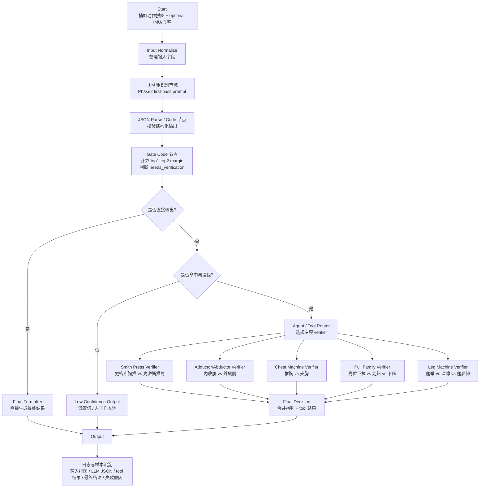

# Dify 动作识别 Workflow 设计

## 目标

把当前 Phase2 从「一次 LLM prompt 直接判断动作」升级成：

```text
候选识别 -> 置信度/证据路由 -> 易混动作专项复核 -> 最终合成
```

核心思路不是让 Agent 完全自由发挥，而是用 Dify Workflow 固定主流程，只在易混动作场景中调用专项 verifier tool。

## 当前输入边界

从 Phase2 第一个 LLM 节点开始，不重新设计 Phase1。

必选输入：

- `exercise_grid_image`：单个 EXERCISE 片段的抽帧动作拼图

可选输入：

- `imu_summary`：胸口 IMU 摘要
- `heart_rate_summary`：心率摘要
- `segment_id`
- `start_time`
- `end_time`

注意：

- IMU 位于胸口，和摄像头位置一致。
- IMU 不能精准反映手臂轨迹，只能辅助判断躯干姿态、运动强度、周期性、组间休息和 rep hint。
- 心率不能单独决定动作类别，只能辅助判断运动强度、是否训练中、恢复状态。

## Workflow 总览



## Dify 节点设计

### 1. Start 节点

建议变量：

```json
{
  "exercise_grid_image": "file/image required",
  "imu_summary": "string optional",
  "heart_rate_summary": "string optional",
  "segment_id": "string optional",
  "start_time": "string optional",
  "end_time": "string optional"
}
```

### 2. Input Normalize 节点

作用：

- 判断 IMU 是否存在
- 判断心率是否存在
- 把缺失字段显式标记为 unavailable
- 不要因为传感器缺失惩罚动作候选

IMU 摘要建议格式：

```text
IMU mounted at chest, same position as camera.
posture_hint: seated / standing / supine / bending / unknown
motion_intensity: low / medium / high
periodicity: weak / medium / strong
rep_count_hint: 10
trunk_stability: stable / shaking / walking
quality: good / medium / poor
```

心率摘要建议格式：

```text
heart_rate_available: true
avg_hr: 132
hr_change: rising / stable / falling
intensity_hint: moderate
```

### 3. LLM 粗识别节点

这个节点只做 first-pass，不直接当最终裁决。

Prompt 核心原则：

```text
视频拼图是主证据。
胸口 IMU 只用于躯干姿态、运动强度、周期性、rep hint，不能当作手臂轨迹。
心率只用于强度/是否训练中，不能单独决定动作类别。
confidence 是候选排序信号，不是真实数学概率。
如果 top candidates 接近，必须设置 needs_verification=true。
如果证据不足，必须输出 missing_evidence 和 uncertainties。
```

推荐输出 schema：

```json
{
  "equipment": "string",
  "exercise": "string",
  "confidence": 0.0,
  "top_candidates": [
    {
      "exercise": "string",
      "confidence": 0.0,
      "evidence": ["string"],
      "missing_evidence": ["string"]
    }
  ],
  "ambiguity_group": "smith_press_family | adductor_abductor | chest_machine | pull_family | leg_machine | none",
  "needs_verification": true,
  "sensor_usage": {
    "imu_available": true,
    "heart_rate_available": false,
    "imu_role": "auxiliary only"
  },
  "uncertainties": ["string"]
}
```

### 4. JSON Parse / 校验节点

作用：

- 确保 LLM 输出是 JSON
- 确保 `top_candidates` 至少有一个候选
- 确保 confidence 在 0 到 1
- 如果 JSON 解析失败，进入低置信输出或重试一次

### 5. Gate 节点

建议用 Code 节点，不用 LLM 做路由。

初始规则：

```python
top1 = candidates[0]["confidence"]
top2 = candidates[1]["confidence"] if len(candidates) > 1 else 0
margin = top1 - top2

direct_output = (
    top1 >= 0.78
    and margin >= 0.18
    and needs_verification is False
)

if direct_output:
    route = "final"
elif ambiguity_group != "none":
    route = "verifier"
else:
    route = "low_confidence"
```

阈值不要一开始写死为真理，应通过真实样本调参。

## Verifier Tool 设计

第一版只做最高频易混组，不要一次覆盖所有动作。

优先级：

1. `Smith Press Verifier`
   - 史密斯胸推 vs 史密斯推肩

2. `Adductor/Abductor Verifier`
   - 内收肌 vs 外展肌

3. `Chest Machine Verifier`
   - 推胸 vs 夹胸

4. `Pull Family Verifier`
   - 高位下拉 vs 坐姿划船 vs 绳索下压

5. `Leg Machine Verifier`
   - 腿举 vs 深蹲 vs 腿屈伸

每个 verifier 输入：

```json
{
  "exercise_grid_image": "image",
  "top_candidates": [],
  "imu_summary": "optional string",
  "heart_rate_summary": "optional string",
  "first_pass_evidence": []
}
```

每个 verifier 输出：

```json
{
  "winner": "string",
  "confidence_delta": 0.0,
  "matched_evidence": ["string"],
  "missing_evidence": ["string"],
  "rejected_candidates": [
    {
      "exercise": "string",
      "reason": "string"
    }
  ],
  "still_uncertain": false
}
```

## Final Decision 节点

这个节点负责合并，不重新识别。

规则：

```text
如果 verifier winner 与 first-pass top1 一致：
  提高 final confidence

如果 verifier winner 与 first-pass top2 一致，且 evidence 明确：
  改判为 verifier winner

如果 verifier still_uncertain=true：
  输出低置信，进入样本池

如果没有 verifier：
  使用 first-pass 结果
```

推荐最终输出：

```json
{
  "final_exercise": "string",
  "final_equipment": "string",
  "final_confidence": 0.0,
  "confidence_level": "high | medium | low",
  "used_verifier": true,
  "ambiguity_group": "string",
  "evidence": ["string"],
  "uncertainties": ["string"],
  "debug": {
    "first_pass": {},
    "verifier_result": {}
  }
}
```

## 落地顺序

1. 先搭通主 Workflow：
   - 输入拼图
   - LLM 粗识别
   - JSON 输出

2. 加 Gate：
   - 实现 top1/top2 margin
   - 实现 `needs_verification` 路由

3. 先做一个 `Smith Press Verifier`：
   - 验证 Agent/Tool 路线是否真的降低混淆

4. 再加 `Adductor/Abductor Verifier`：
   - 覆盖另一个高频易混组

5. 保存每次运行的 debug JSON：
   - 输入拼图
   - first-pass JSON
   - gate route
   - verifier 结果
   - 最终结果
   - 是否人工确认正确

6. 用真实样本调阈值：
   - top1 阈值
   - top1-top2 margin
   - 哪些 ambiguity_group 必须进 verifier

7. 最后考虑把 verifier 从 LLM prompt 迁移为外部 Python/FastAPI tool：
   - 姿态/检测/规则模型
   - 更可控、更可测

## 对研发的表达

这版 Dify 不是替代现有识别代码，而是把 Phase2 从：

```text
单 prompt 直接判断
```

升级成：

```text
候选识别 + 路由 + 专项复核 + 可审计日志
```

这样可以减少巨型 prompt 的注意力涣散，也方便把高频误判逐个做成 verifier 补丁。
