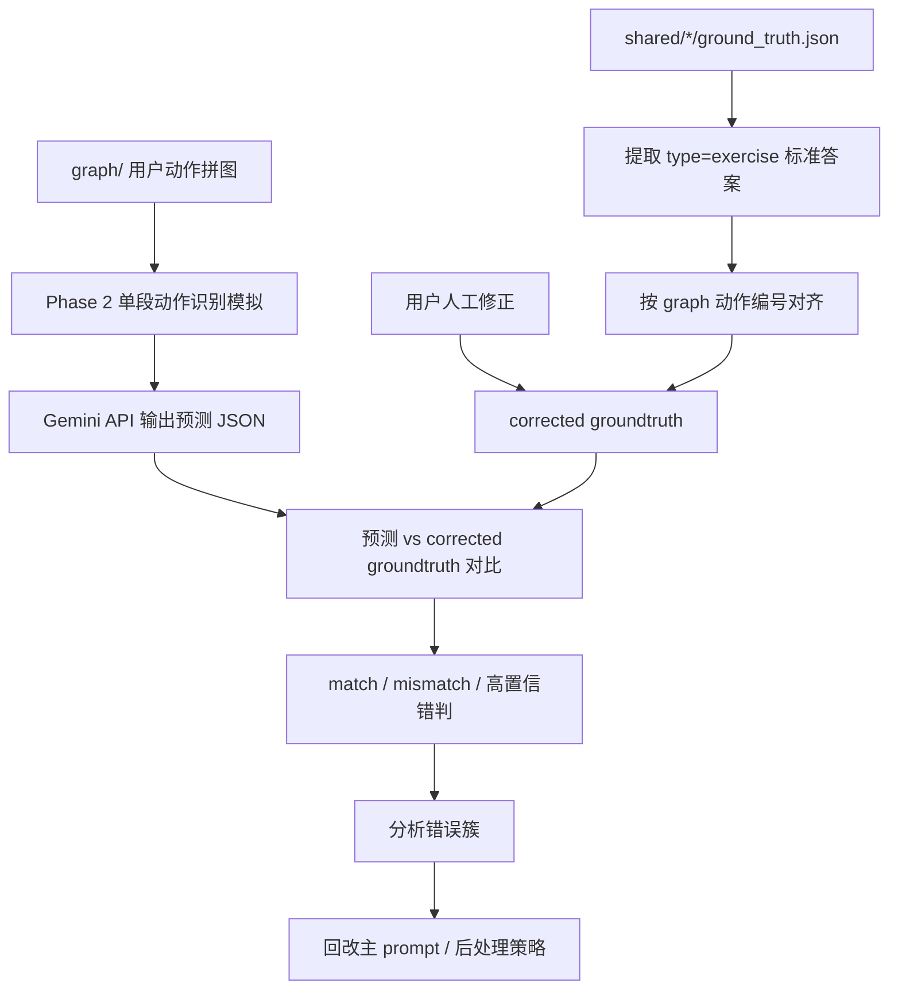
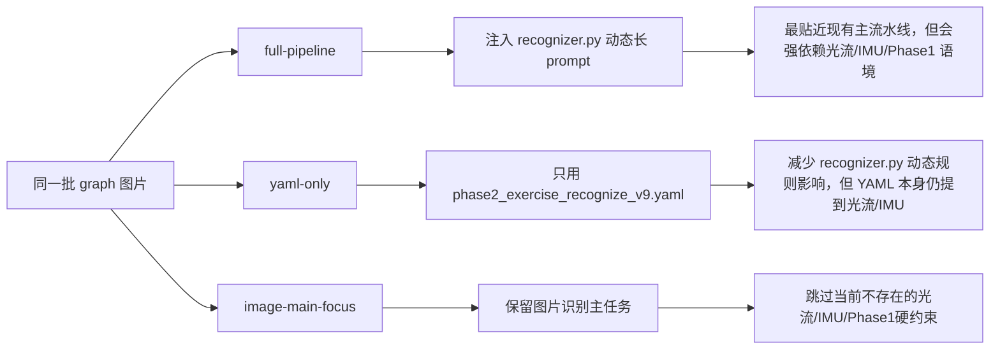
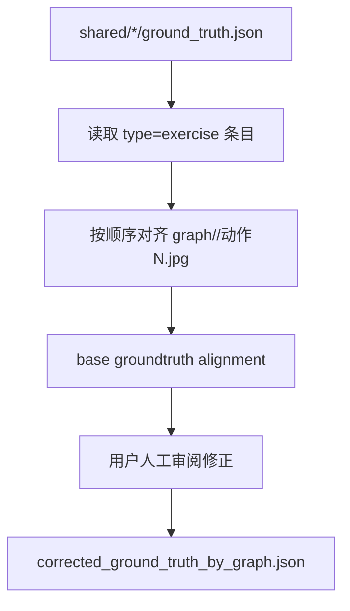
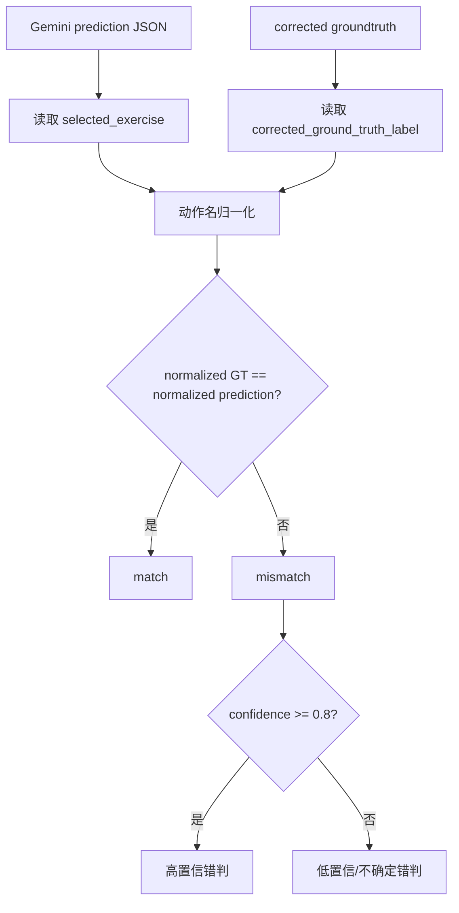
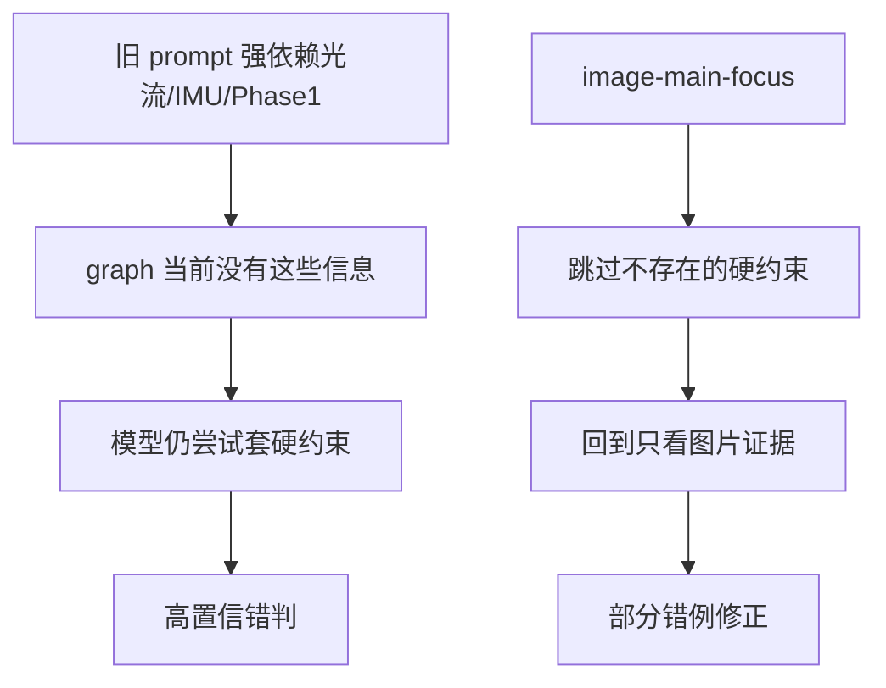
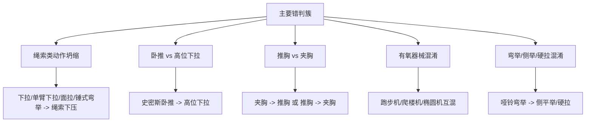
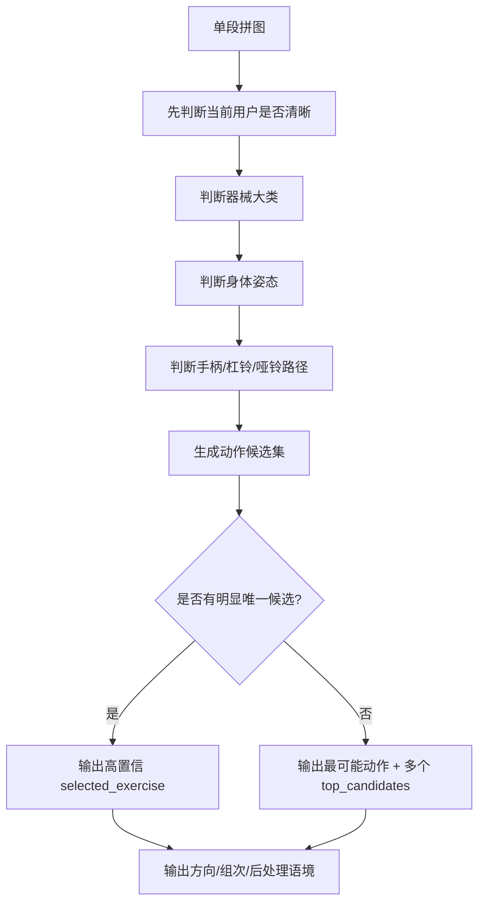

# Graph 动作识别验证 Flow 说明

这份 flow 用来解释当前验证工作的整体思路：我们不是在直接改主流水线，而是在 `graph_workflow_validation/` 里搭一套独立验证闭环，用 graph 抽帧拼图模拟 Phase 1 切段后的 Phase 2 单段识别，然后和人工修正后的 groundtruth 对比，找出 prompt / 视觉判别规则的问题。

## 总览

## 当前输入是什么

当前输入是 `graph/` 文件夹里的图片：

- 每个用户一个子目录。
- 每张 `动作N.jpg` 是某段动作的抽帧拼图。
- 拼图模拟的是：Phase 1 已经把视频切出一个运动片段，然后 Phase 2 对这个片段单独识别。

关键限制：

- 没有真实光流。
- 没有 IMU。
- 没有 Phase 1 的 equipment/posture 参考值。
- 没有入场帧原图。
- 没有完整时间戳和真实 rep 周期。

所以这套验证不能把光流/IMU/Phase1 当硬证据，只能用图片里可见的器械、姿态、手柄/杠铃位置、身体方向、帧间变化来判断。

## 三种识别口径

### full-pipeline

目标是验证“严格按现在主流水线”会发生什么。

做法：

- 调用项目里的 Gemini/nextrouter API。
- 把 `gym_analyzer/recognizer.py` 中 `_recognize_one_exercise` 的动态 prompt 构造源码注入给模型。
- 要求模型按主流水线规则输出动作。

问题：

- `recognizer.py` 里有大量光流、IMU、Phase 1、入场帧约束。
- graph 当前没有这些输入。
- 模型会在缺证据时仍受这些规则影响，出现高置信错判。

### yaml-only

目标是看不注入 `recognizer.py` 动态规则时会怎样。

做法：

- 只用 `gym_analyzer/prompts/phase2_exercise_recognize_v9.yaml`。

结论：

- 整体没有明显变好。
- YAML 本身也包含光流/IMU/Phase1相关要求。
- 它更愿意输出 UNKNOWN 或低置信，但也会损失一些动态规则带来的正确判断。

### image-main-focus

目标是验证用户当前真正关心的流程：

> Phase 1 切出每段运动后，对每段单独调用一次 AI，回答器械、动作、动作方向、分了几组、每组几次，并给出后处理所需语境。

做法：

- 仍然调用项目里的 Gemini/nextrouter API。
- 只重跑 full-pipeline 中已经 mismatch 的 39 张图片。
- 明确告诉模型：当前没有光流、IMU、Phase1参考、入场帧，所以跳过这些硬约束。
- 仍然要求输出：
  - `selected_equipment`
  - `selected_exercise`
  - `selected_confidence`
  - `top_candidates`
  - `context`
  - `sets`
  - `total_sets`
  - `total_reps`
  - `action_disambiguation`

结论：

- 39 个原错例里修好 6 个。
- 仍错 33 个。
- 说明光流/IMU 硬约束确实造成了一部分问题，但不是主要错误源。
- 主要错误源仍是图片视觉判别和易混动作候选优先级。

## Groundtruth 如何来

原始标准答案来自：

- `shared/<folder>/ground_truth.json`
- 只抽取 `type=exercise` 的条目。

对齐方式：

- 按用户目录和动作顺序，把 `type=exercise` 标签对齐到 `graph/<folder>/动作N.jpg`。
- 目录数量不一致时，之前做过相邻动作合并尝试。
- 用户后续人工修正覆盖原始标签。

重要规则：

- 用户提到的动作，以用户修正为准。
- 用户没提到的动作，沿用原始/base groundtruth。
- `腿-张开/动作6` 和 `腿-张开/动作8` 保留为 `未知动作`，不是删除。

输出：

- `graph_workflow_validation/ground_truth_alignment/corrected_ground_truth_by_graph.json`
- `graph_workflow_validation/ground_truth_alignment/corrected_ground_truth_by_graph.md`

## 对比怎么做

归一化的意义：

- 避免中英文 id 或同义动作名导致假 mismatch。
- 例如：
  - `barbell_squat` = `杠铃深蹲`
  - `smith_bench_press` = `史密斯卧推`
  - `高位直杆下拉` / `直杆高位下拉` = `高位下拉`
  - `坐姿绳索划船` = `划船`
  - `stepmill` = `爬楼机`
  - `UNKNOWN_ACTION` = `未知动作`

对比脚本：

- `graph_workflow_validation/compare_predictions_to_corrected_gt.py`

## 当前结果概览

| 口径 | 评估数量 | match | mismatch | API error | 备注 |
|---|---:|---:|---:|---:|---|
| full-pipeline | 63 | 24 | 39 | 0 | 最贴近主流水线，但受缺失光流/IMU影响 |
| yaml-only | 63 | 23 | 39 | 1 | 不注入动态长规则，整体没更好 |
| image-main-focus | 39 | 6 | 33 | 0 | 只重跑原错例，修好 6 个 |

注意：`image-main-focus` 的 39 不是全量 63，而是只评估原 full-pipeline 的 mismatch。

## 为什么 image-main-focus 有少量变好

这轮变好的原因不是去掉易混淆动作。

真正变化是：

- 跳过了当前输入不具备的光流/IMU/Phase1硬约束。
- 把易混动作从“强制改判规则”变成“候选保留和置信度校准”。
- 让模型更贴近 graph 图片的真实输入形态。

但只修好 6/39，说明：

- 光流/IMU 不是唯一问题。
- 图片视觉判断本身还需要更强的动作判别规则。
- 易混动作表仍要保留，而且要更精细。

## 当前主要错误簇

## 后续应该怎么改

下一步不建议简单删除易混动作规则。更合理的是改成图片输入适配版的判别流程：

重点要补的 prompt 规则：

- 绳索类动作：
  - 高位下拉：通常坐姿或稳定下拉位，手柄/直杆从头顶向胸前/锁骨方向拉。
  - 绳索下压：通常站姿，肘靠近身体，手从胸前/上腹向下压到髋部附近。
  - 单臂绳索下拉：单手，常见一侧滑轮，路径从上方向身体一侧下拉。
  - 面拉：绳索/绳柄朝脸部或上胸拉，肘向外打开，不是向下压。
  - 绳索锤式弯举：手从低位向上弯举，肘相对固定，不是从上往下压。
- 卧推 vs 高位下拉：
  - 仰卧/上斜卧姿、胸前杠铃、史密斯导轨、长凳可见时，应优先卧推。
  - 不要因为看到上方架体就判高位下拉。
- 推胸 vs 夹胸：
  - 没有光流时，不要使用“LEFT/RIGHT vs FORWARD/BACKWARD 光流纠正机制”。
  - 改用把手位置、手臂是否水平内收、胸部器械形态判断。
- 有氧器械：
  - 跑步机看履带。
  - 爬楼机看阶梯踏板。
  - 椭圆机看椭圆踏板和长摆臂。
- 置信度：
  - 若只看到器械但动作路径不清楚，置信度不要超过 0.7。
  - 若多个候选接近，必须输出多个 `top_candidates`。

## 最终目标

这套验证流最终服务于主流水线 prompt 的改造：

1. 用 `graph/` 快速暴露动作识别错判。
2. 用 corrected groundtruth 做客观评估。
3. 找出高置信错判簇。
4. 修改主 prompt 的图片判别规则和后处理策略。
5. 再用同一套脚本重跑并比较。

也就是说，`graph_workflow_validation/` 是一个 prompt/workflow 回归测试夹具，不是主业务输出。
